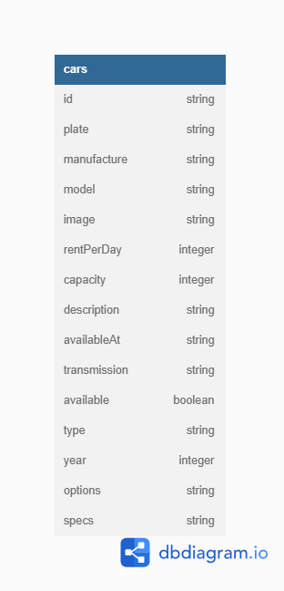

## Summary

Car Management Dashboard Website

- Build using Node JS, PostgreSQL, Express and Sequelize
- Entity Relationship Diagram : https://dbdiagram.io/d/643678e38615191cfa8d497f
- Entity Relationship Diagram Preview :

  

## Endpoints

- /                   : Home Page
- /cars               : List Car Page
- /cars/add           : Create New Car Page
- /cars/edit/:id      : Edit Car Page

- /cars               : API Endpoint for Create New Car
- /cars/edit/:id      : API Endpoint for Edit Car
- /cars/delete/:id    : API Endpoint for Delete Car
